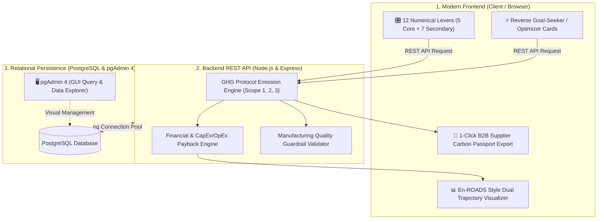

# 🌍 NetZero PET™ - Factory Decarbonization & Payback Simulator

> **Enterprise Decision-Support Simulation for Small & Medium PET Bottle Manufacturers (MSMEs)**  
> *Simulates operational and material decarbonization levers before spending capital — linking real-time carbon reduction with financial ROI and payback timelines.*

---

## 📌 Executive Overview

Small and medium PET bottle manufacturers face severe regulatory pressure (FSSAI/PWM rPET mandates) and Scope 3 supplier carbon disclosure demands from large FMCG beverage buyers.

Existing enterprise platforms (Salesforce Net Zero Cloud, Watershed) are retrospective reporting tools for SEBI top-1,000 conglomerates requiring complex ERP/IoT integrations. **NetZero PET™** fills the MSME gap: an interactive, forward-looking simulator that models physical manufacturing levers and immediately outputs **both emissions trajectories and a net cumulative cash breakeven schedule (2025–2030)**.

---

## 📐 System Architecture



---

## 🔬 Mathematical Modeling & Formulations

### 1. GHG Protocol Emissions Breakdown
* **Scope 1 (Direct Fuel):**  
  $$\text{Scope 1 (kg CO}_2\text{e)} = \text{Diesel Usage (L)} \times (1 - \text{Route Opt \%}) \times 2.68\text{ kg CO}_2/\text{L}$$
* **Scope 2 (Purchased Electricity with Physics Energy Floor):**  
  $$\text{Effective Efficiency Multiplier} = \max\left(0.35,\; (1 - \text{Machine Eff \%}) \times (1 - \text{Heat Recovery \%} \times 0.15) \times \frac{\text{Pressure Bar}}{35}\right)$$  
  $$\text{Scope 2 (kg CO}_2\text{e)} = (\text{Volume} \times \text{Base Energy/btl} \times \text{Effective Multiplier}) \times 0.79 \times (1 - \text{Renewable \%})$$
* **Scope 3 (Resin Footprint):**  
  $$\text{Scope 3 Resin (kg CO}_2\text{e)} = (\text{Virgin PET kg} \times 2.30) + (\text{rPET kg} \times 0.45)$$
* **Carbon Intensity per Bottle:**  
  $$\text{Carbon Intensity (g CO}_2\text{e / bottle)} = \frac{\text{Total Emissions (kg CO}_2\text{e)} \times 1000}{\text{Annual Production Volume}}$$

---

## 🗄️ Database Design (PostgreSQL & pgAdmin 4)

The database schema is structured into normalized relational entities:
- **`factories`**: Factory profile, location, annual baseline capacity.
- **`scenarios`**: Saved simulation configurations with author metadata.
- **`scenario_inputs`**: Granular key-value slider states per scenario.
- **`scenario_results`**: Comprehensive emissions, intensity, OpEx, CapEx, and payback outputs.
- **`emission_factors`**: Reference LCA factors with citations (PlasticsEurope, ALPLA, CEA India).
- **`v_scenario_comparison`**: Analytical SQL view for instant querying in pgAdmin 4.

---

## 🚀 Quickstart Guide

### Step 1: Install Dependencies
```bash
npm install
```

### Step 2: Database Setup in PostgreSQL & pgAdmin 4
1. Open **pgAdmin 4** on your laptop.
2. Create a new database named `netzero_pet_db`.
3. Open the **Query Tool** on `netzero_pet_db`.
4. Open and execute `database/schema.sql`, then execute `database/seed.sql`.
5. Copy `.env.example` to `.env` and configure your Postgres password:
   ```env
   PORT=5000
   DB_HOST=localhost
   DB_PORT=5432
   DB_USER=postgres
   DB_PASSWORD=your_postgres_password
   DB_NAME=netzero_pet_db
   ```

### Step 3: Run the Test Suite
```bash
npm test
```

### Step 4: Start the Full-Stack Application
```bash
npm start
```
Open **`http://localhost:5000`** in your browser to access the live interactive simulator!

---

## 📦 Pushing to GitHub (Step-by-Step)

To initialize and push this codebase to your GitHub repository:

```bash
# 1. Initialize git repository
git init

# 2. Add all files
git add .

# 3. Create first commit
git commit -m "feat: initial release of NetZero PET MSME Decision Simulator with PostgreSQL & REST API"

# 4. Create main branch
git branch -M main

# 5. Link your GitHub remote repository (replace with your repo URL)
git remote add origin https://github.com/YOUR_USERNAME/Net_Zero_PET_Simulator.git

# 6. Push to GitHub
git push -u origin main
```

---

## 📄 License
This project is open-source under the MIT License.
